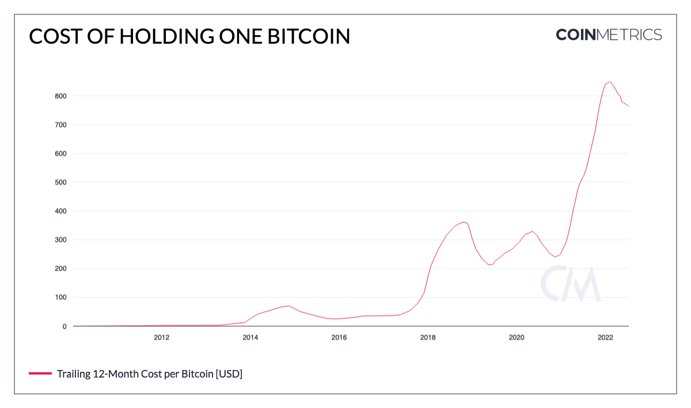

## Bitcoin: Cost of Holding One Bitcoin

The dollar denominated dilution per bitcoin for the trailing 12-months. Essentially the amount of revenue extraction from the mining subsidy, assuming that miners sell their newly mined coins at the end of each day.

JSON to create an up to date model of the figure below.

