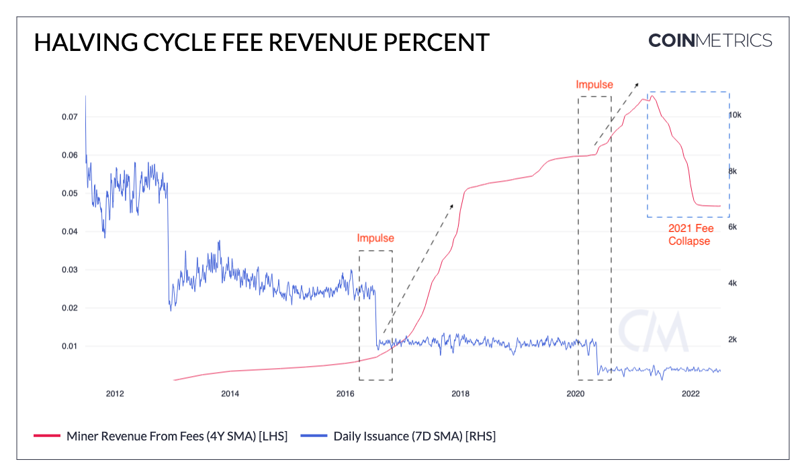

# CoinMetrics Formula Builder Models

This repository contains a collection of JSON files designed to create figures in the CoinMetrics online formulat builder. An example output is included below. 

## Downloading JSON files from GitHub

The online UX for downloading individual files is not really ideal, if you don't want to clone or download the whole repo, navigate to file (main -> directory -> .json file), and then right click where it says `Raw` and you should be able to save the file as .json without any GitHub formatting and then load it directly into the [Coin Metrics Formula Builder](https://charts.coinmetrics.io/formulas/). Alternatively, if you click `Raw` then you can also save the webpage as .json and that should work too. 

## Author

@Data_Always from dataalways.substack.com
